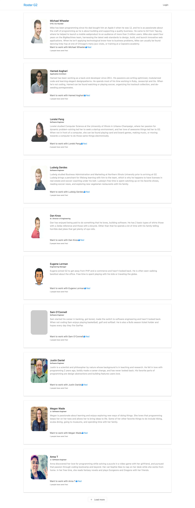

## G2 Roster Employ APP


## Steps to Setup the Spring Boot Back end APP(rosters)

1. **Clone the application**

	```bash
    copy rosters folder to your laptop
	   cd rosters
	```

2. **Create Postgress database**

	```bash
	create database roster_db
	```

3. **Change Postgress username and password as per your Postgress installation**

	+ open `src/main/resources/application.properties` file.

	+ change `spring.flyway.username` and `spring.datasource.password` properties as per your postgress installation
	
	+ change `spring.datasource.username` and `spring.flyway.password` properties as per your postgress installation

4. **Run the app**

	You can run the spring boot app by typing the following command -

	```bash
	mvn spring-boot:run
	```

	The server will start on port 8080.

## Steps to Setup the React Front end app (roster-app-client)

First copy `roster-app-client` folder  to your laptop-

```bash
cd roster-app-client
```

Then type the following command to install the dependencies and start the application -

```bash
npm install && yarn start
```

The front-end server will start on port `3000`.
